---
# theme id or package name
# Learn more: https://sli.dev/themes/use.html
theme: seriph
# title of your slide, will auto infer from the first header if not specified
title: 'REST API Architektur'
# titleTemplate for the webpage, `%s` will be replaced by the page's title
titleTemplate: '%s - Slidev'
# information for your slides, can be a markdown string
info: false

# enabled pdf downloading in SPA build, can also be a custom url
download: false
# filename of the export file
exportFilename: 'slidev-exported'
# syntax highlighter, can be 'prism' or 'shiki'
highlighter: 'prism'
# show line numbers in code blocks
lineNumbers: false
# enable monaco editor, can be boolean, 'dev' or 'build'
monaco: 'dev'
# download remote assets in local using vite-plugin-remote-assets, can be boolean, 'dev' or 'build'
remoteAssets: false
# controls whether texts in slides are selectable
selectable: true
# enable slide recording, can be boolean, 'dev' or 'build'
record: 'dev'

# force color schema for the slides, can be 'auto', 'light', or 'dark'
colorSchema: 'auto'
# router mode for vue-router, can be "history" or "hash"
routerMode: 'history'
# aspect ratio for the slides
aspectRatio: '16/9'
# real width of the canvas, unit in px
canvasWidth: 980
# used for theme customization, will inject root styles as `--slidev-theme-x` for attribute `x`
themeConfig:
  primary: '#5d8392'

# favicon, can be a local file path or URL
favicon: 'https://cdn.jsdelivr.net/gh/slidevjs/slidev/assets/favicon.png'
# URL of PlantUML server used to render diagrams
plantUmlServer: 'https://www.plantuml.com/plantuml'
# fonts will be auto imported from Google fonts
# Learn more: https://sli.dev/custom/fonts
fonts:
  sans: 'Roboto'
  serif: 'Roboto Slab'
  mono: 'Fira Code'

# default frontmatter applies to all slides
defaults:
  layout: 'default'
  # ...

# drawing options
# Learn more: https://sli.dev/guide/drawing.html
drawings:
  enabled: true
  persist: false
  presenterOnly: false
  syncAll: true

layout: cover
# random image from a curated Unsplash collection by Anthony
# like them? see https://unsplash.com/collections/94734566/slidev
background: https://source.unsplash.com/collection/94734566/1920x1080
# apply any windi css classes to the current slide
class: 'text-center'
---

# REST API Architektur

## Was und wie machen wir REST?

Stark angelehnt an die REST Talks von Dylan Beattie

---
layout: full
---

<Youtube src="https://youtube.com/embed/kPrTMj-BK14?t=19" width="100%" height="100%"/>

---
class: text-center
---

# Slides & Code

## github.com/n1LWeb/REST-API-Architecture

---

# Agenda

- Was bedeutet REST, was ist REST
- Herobook

---
layout: image-left
image: ./fielding.webp
---

# Roy T. Fielding
Roy Thomas Fielding (* 1965 in Laguna Beach, Kalifornien, USA) ist ein US-amerikanischer Informatiker, einer der Hauptautoren der HTTP-Spezifikation, Mitgründer und Vorsitzender der Apache Software Foundation.

Fielding erhielt im Jahr 2000 seinen Doktorgrad von der University of California, Irvine für seine Dissertation Architectural Styles and the Design of Network-based Software Architectures, die den Representational State Transfer (REST) als eine Schlüsselarchitektur für das World Wide Web beschreibt und große Anerkennung bekam.

http://www.ics.uci.edu/~fielding/pubs/dissertation/top.htm

---
layout: quote
image: fielding.webp
---


# When given a name, a coordinated set of architectural constraints becomes an architectural style

<v-click>

<br/>

## Ein koordinierter Satz von architektonischen Einschränkungen wird zu einem Architekturstil, wenn er einen Namen erhält.

</v-click>

---
layout: quote
image: fielding.webp
---


# **REST** is software design on the *scale* of **decades**: every detail is intended to promote software longevity and independent evolution.

# Many of the constraints are directly opposed to short-term efficiency.

<v-click>

## REST ist Softwaredesign für Jahrzehnte: Jedes Detail ist darauf ausgerichtet, die Langlebigkeit und unabhängige Weiterentwicklung der Software zu fördern.

## Viele der Einschränkungen stehen im direkten Gegensatz zur kurzfristigen Effektivität.

</v-click>

---
layout: default
---

# Was bedeutet REST, was ist REST

## 1. Server-Client

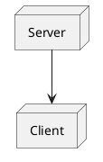

<v-click>

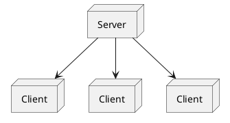


</v-click>

---
layout: default
---

# Was bedeutet REST, was ist REST

## 2. Stateless

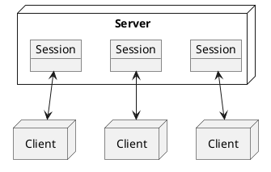

<v-click>

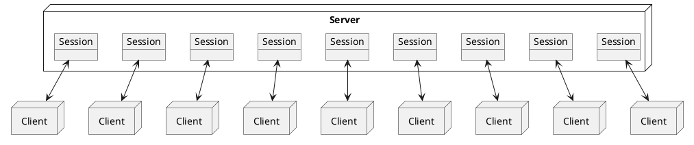

</v-click>

---
layout: default
---

# Was bedeutet REST, was ist REST

## 2. Stateless

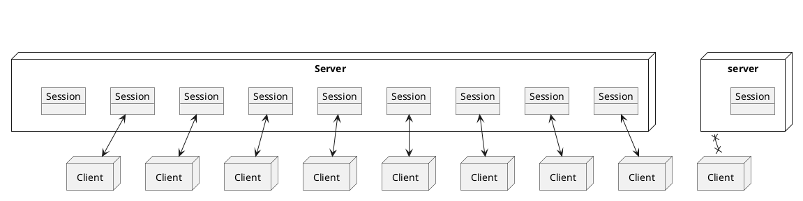

---
layout: two-cols
---

<template v-slot:default>

# Was bedeutet REST, was ist REST

## 3. Cacheable

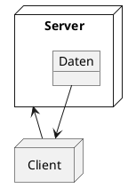

</template>

<template v-slot:right>


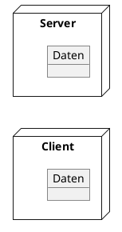

</template>

---
layout: default
---

# Was bedeutet REST, was ist REST

## 3. Cacheable


---
layout: two-cols
---

<template v-slot:default>

# Was bedeutet REST, was ist REST

## 4. Layered System

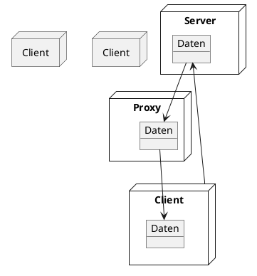

</template>

<template v-slot:right>
<v-click>

<br/>
<br/>
<br/>
<br/>
<br/>
<br/>
<br/>

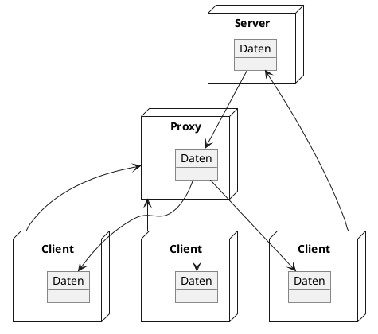

</v-click>
</template>

---
layout: default
---

# Was bedeutet REST, was ist REST

## 4. Layered System

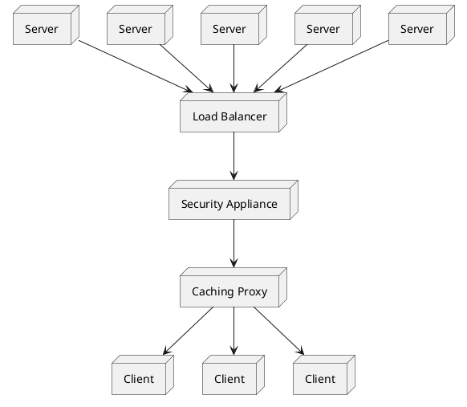

---
layout: default
---

# Was bedeutet REST, was ist REST

## 5. Uniform Interface

<br/>
<br/>

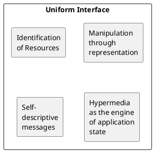

---
layout: default
---

# Was bedeutet REST, was ist REST

## 6. Code on Demand (optional)

Der Client kann code übertragen, welcher auf dem Client ausgeführt wird. (bisher noch in keiner API gesehen)

---
layout: default
---

# Was bedeutet REST, was ist REST

## A Set of Architectural Contraints

1. Client Server
1. Stateless
1. Cacheable
1. Layered System
1. Uniform Interface
1. Code-on-demand (optional)

---
layout: default
---

# Herobook

```http
GET / HTTP/1.1

200 OK
Content-Type: application/json
{
  "message": "Welcome to Herobook!"
}

```

---
layout: two-cols
---

<template v-slot:default>

```http
GET /profiles HTTP/1.1

200 OK
Content-Type: application/json
[
  {
    "username": "ironman",
    "name": "Tony Stark"
  }
]
```

</template>
<template v-slot:right>

```http
POST /profiles HTTP/1.1
{
  "username": "blackwidow",
  "name": "Natalia Romanova"
}

201 Created
Location: http://api.herobook.com.local/profiles/blackwidow
{
  "username": "Blackwidow",
  "name": "Natalia Romanova"
}
```

</template>

---
layout: cover
# random image from a curated Unsplash collection by Anthony
# like them? see https://unsplash.com/collections/94734566/slidev
background: https://source.unsplash.com/collection/539016/1920x1080
# apply any windi css classes to the current slide
class: 'text-center'
---

# Einen Tag Später

---
layout: default
---

```http
GET /profiles HTTP/1.1

200 OK
[
  { "username": "ironman", "name": "Tony Stark" },
  { "username": "Blackwidow", "name": "Natalia Romanova" },
  { "username": "spidey", "name": "Peter Parker" },
  
  { /* 2 Millionen Benutzer!!! /* },

  { "username": "Da DevOps Architect", "name": "Marc Lucks" }
]
```

---
layout: cover
# random image from a curated Unsplash collection by Anthony
# like them? see https://unsplash.com/collections/94734566/slidev
background: https://source.unsplash.com/collection/539016/1920x1080
# apply any windi css classes to the current slide
class: 'text-center'
---

# Einen Tag Später

---


https://youtu.be/kPrTMj-BK14?t=912

https://roy.gbiv.com/untangled/2008/rest-apis-must-be-hypertext-driven

Richardson Maturity Model

https://martinfowler.com/articles/richardsonMaturityModel.html#level1

0 – exporting an API over HTTP with methods called with arguments
1 – Exporting resources instead of methods
2 – Proper use of HTTP verbs
3 – Exporting hypertext with objects that make all or part of the API discoverable.

